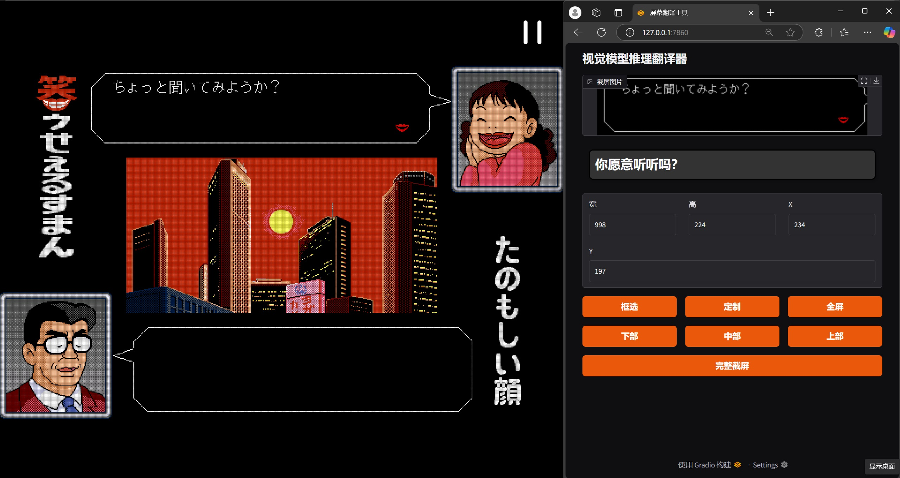

# PC98 Visual Novel Game Screen Translation Tool

## 📌 Project Overview
This project provides **automatic translation support for PC98 visual novel games**.  
It captures game text through **screenshot processing** and uses the **Qwen2.5-VL-3B multimodal model** for **Japanese-to-Chinese translation**.  
The frontend (`front.py`) runs on **Windows 11**, while the backend (`back.py`) runs on **Ubuntu**, communicating via API.

---




## 🚀 Installation & Usage
This tool consists of **a frontend (Windows 11)** and **a backend (Ubuntu)**, which must be installed and run separately.

### **🖥️ 1. Windows 11 Frontend**
#### **(1) Install Dependencies**
```sh
cd frontend
pip install -r requirements.txt
```
#### **(2) Run the Frontend**
```sh
python front.py
```
(3) Features
Screenshot Modes: Supports custom selection, full screen, lower/middle/upper predefined areas.
API Calls: Automatically requests translation from the backend and displays results.

### **🌐 2. Ubuntu Backend**
#### **(1) Install Dependencies**
```sh
cd backend
pip install -r requirements.txt
```
#### **(2) Run the Frontend**
```sh
python back.py
```
(3) Features
Listens on port 8000, waiting for frontend requests.
Processes captured text, calling the Qwen2.5-VL-3B model for inference.
Returns translated results to the frontend.

🛠️ Tech Stack
Frontend:
Gradio: For interactive UI
PyAutoGUI: For screen capture
Tkinter: For area selection
Requests: For API calls
Backend:
FastAPI: Provides HTTP API
Torch + Transformers: For Qwen2.5-VL-3B model inference
Uvicorn: Runs the backend service
glob: Automatically retrieves the latest screenshots

🎯 Usage Instructions

1️⃣ Screenshot Translation
Run the frontend (front.py), and select a screenshot area.
Once captured, the frontend automatically sends a request to the backend.
The backend processes the text using the Qwen2.5-VL-3B model for Japanese-to-Chinese translation.
The translated result will be displayed in the Gradio interface.

2️⃣ Direct API Call

The backend provides a REST API:

POST http://localhost:8000/translate

You can directly call the API via:

curl -X POST http://localhost:8000/translate
